# Midterm 

## Review 1
#### What is the Waterfall model?
It suggests a sequential approach to software development that begins with customer specification of requirements and progresses through planning , modeling, constructing, and deployment, culminating in ongoing support of the completed software.
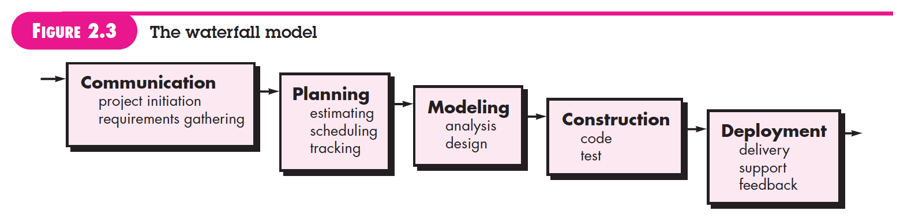

#### What are the properties of the Waterfall model?
- The project consists of sequential, non-overlapping phases, where a phase cannot begin until the previous phase is completed.
- At the end of every phase, there is a gate where a decision is made to allow the project to move forward or not.
- Changes are controlled. Major changes are only allowed if Change Control Board approves them.
- The product is ony finished a the end of the last phase.
- Once the project is done, the product/service enteres into a maintenance phase.
- Low overhead of the methodology compared to other models such as Agile.

#### What are the different steps of the Waterfall model?
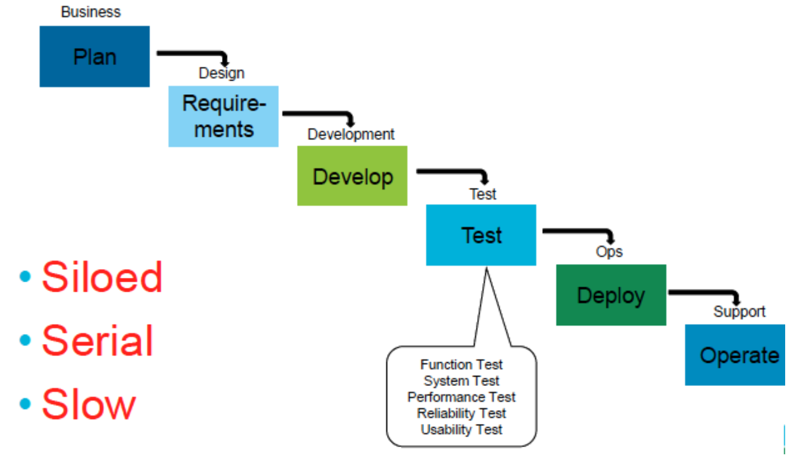

#### Define Unit testing
Unit testing is a software development process in which the smallest testable parts of an application, called units, are individually scrutinized for proper operation. 

#### Define System testing
System testing is testing conducted on a complete, integrated system to evaluate the system's compliance with its specified requirements. It falls in the scope of black-box testing, and requires no knowledge of the inner design. The purpose is to detect any inconsistencies between units.

#### What are the 4 parts of V-diagram? For each part, how much time do you expect to spend in each?
1/3 planning (requirements, design); 1/6 coding; 1/4 unit test (testing code written by one programmer); 1/4 system test (testing code assemblies built by multiple programmers).
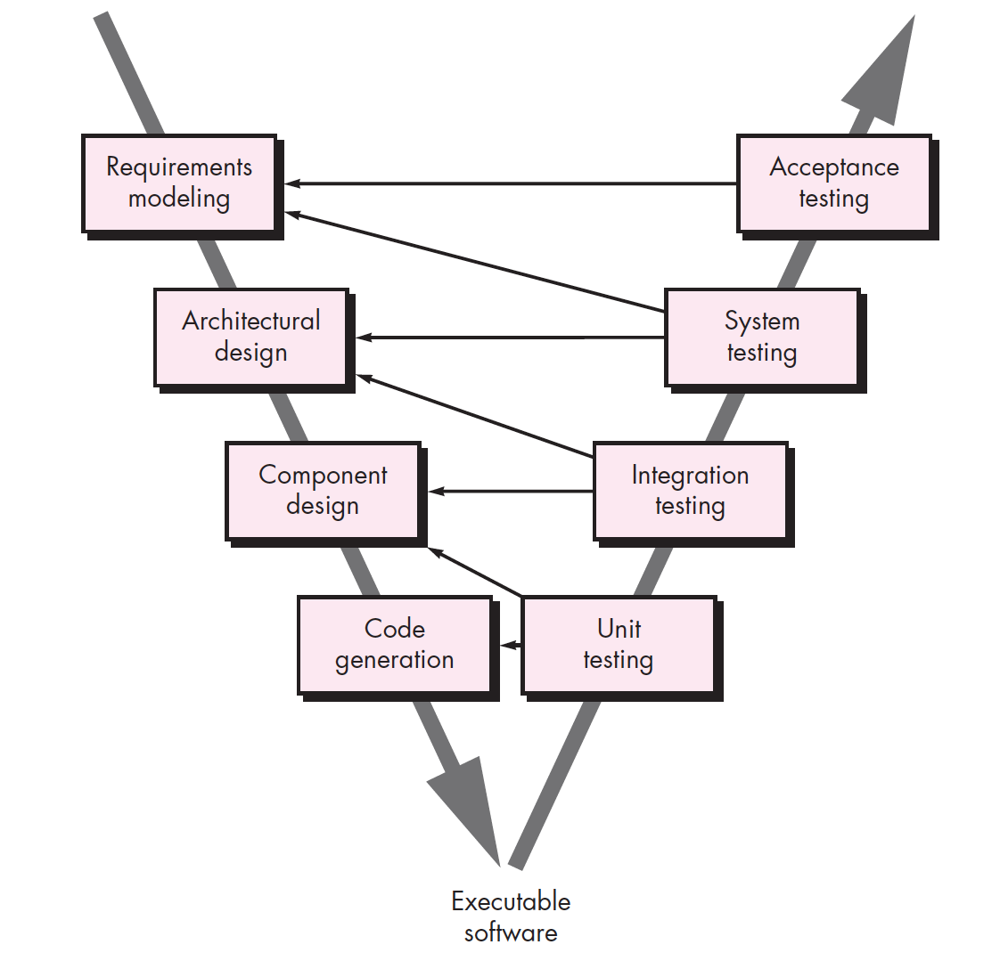

#### What are the parts of a 3-tier architecture? Given the middle part(model) as N, how much lines of code is the total?
The 3-tier architecture is a client-server architecture in which presentation(user interface), application processing(functional process logic), and data management funcitons are physically separated. It provides a model by which developers can create flexible and reusable applications.
The rule of thumb is that each business object needs
- about 1 class to do the connect and translation to the DB
- about 1 class to do the connection and interaction with the GUI
- about half a class of "helper" utilities
 
so 2.5 classes + the original = 3.5 N

#### What is dialog independence?
The decoupling of the Computer-Human Interface from the core application software.

#### What is data independence? Name a tool that supports data independence.
The separation of data from the applications that use the data. DBMS implement data independence that hides the detail of the physical data storage structure from user application, and with logical data independence, gives the feature of data abstraction.

#### What is Brook's law?
It is a claim about software project management that "adding manpower to a late software project makes it later." 

#### Explain why adding more people to a late project does not help.
- It takes some time for the people added to become productive. (Ramp up time)
- Communication overheads increase as the number of people increases.
- Limited divisibility of tasks.

#### What are Brook's rules of thumb for software development costs?
1/3 planning (requirements, design); 1/6 coding; 1/4 unit test (testing code written by one programmer); 1/4 system test (testing code assemblies built by multiple programmers).

#### What is Royce's critique of the Waterfall model? What is his preferred solution?
Critique: 
- Unfortunately, design iterations are never confined to the sucessive steps.
- Later tests can lead to changes to document very much upstream.

Solution: More documentation
- Write an overview document that is understandable, informative and current. Each and every worker mush have an elemental understanding of the system. At least one person must have a deep understanding of the system which comes partially from having had to write an overview document.

#### List and define three common practices of Agile/XP
Planning:
- Release planning creates the release schedule.
- Make frequent small releases.
- The project is divided into iterations.
- Iteration planning starts each iteration.

Coding:
- The customer is always available.
- Code ust be written to agreed standards.
- Code the unit test first.
- All production code is pair programmed.
- Only one pair integrated code at a time. 
- Set up a dedicated integration computer.
- Use collective ownership.

Testing:
- All code must have unit tests. 
- All code must pass all unit tests before it can be released.
- When a bug is found, tests are created.
- Acceptance tests are run often and the score is published. 

#### What are the advantages of Agile method over other processes?
- Customer satisfaction by rapid, continuous delivery of useful software.
- People and interactions are emphasized rather than process and tools. Customers, developers and testers constantly interact with each other.
- Working software is delivered frequently.
- Face-to-face conversation is a productive form of communication.
- Close, daily cooperation between business people and developers.
- Continuous attention to technical details and good desgin.
- Regular adaption to ching circumstances.
- Even late changes in requirements are welcomed.

#### What are the shortcomings of Agile method?
- In case of some software deliverables, especially the large ones, it is difficult to assess the effort required at the beginning of the software development life cycle.
- There is lack of emphasis on necessary designing and documentation.
- The project can easily get taken off track if the customer representative is not clear what final outcome that they want.
- Only senior programmers are capable of taking the kind of decisions required during the development process. Hence, it can be harder for newbies to be agile, unless combined with experienced resources.

#### For what kind of project would you use Agile? Explain
Flexible product development with constant update.

#### For what kind of project would you use Waterfall? Explain
Highly structured projects in which after-the-fact changes are prohibitively costly, if not impossible 

#### What are the activities involved in DevOps?
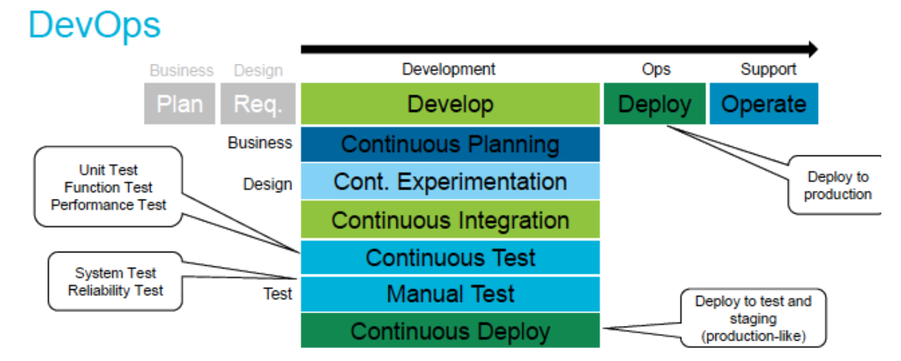
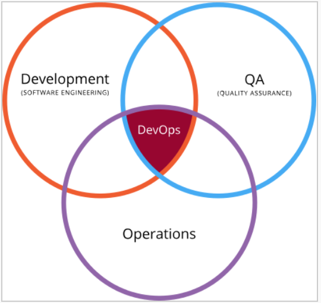

## Review 2
### Theory:
#### Why might, in theory, software development effort grow exponentially with size (LOC)?
Software is complex and has lots of bugs. A software system with N modules has $N^2$ possible intraconnections, each of which must be designed and built and tested and maintained. 

#### In practice, software effort does not grow exponentially with size (LOC). Give 2 reasons why this might be so.
High-quality flexible and reusable codes. Powerful and smart software development tools. Mature testing strategies.

### C, Go, C++:
#### C++ and Go are variations of which language?
C

#### List the order of creation for C, C++ and Go.
C -> C++ -> Go

#### List one innovation in C++ over C. In two lines, explain the SE implications of that innovation.
C++ can use classes to provide extensible types and package data and its related behaviors as methods. This abstract design can promote code reusability in future development.

#### List one innovation in Go over C++. In two lines, explain the SE implications of that innovation.
Concurrency, garbage collection, interface types, reflection, type switches. Because of garbage collection, it makes interfaces easier to specify, and also make concurrency more automatic without worry about the ownerships of memory piece, which save lots of programming effort in memory allocation and freeing.

#### What is the technical role of the header file in C?
To declare functions, macros and variables that are available. 
C function declarations and macro definitions to be shared between several source files.

#### What is the process role of the header file?
- To ensure that all developers use the same version of data layout definition or procedural code throughout the project.
- Easily cross-reference where components are used in a system.
- Easily change programs when needed. 
- Save time by not needing to code extensive data layouts.

#### Give a specific project that would use C? List two reasons, justify each.
Develop an OS for wearable device. Performance, efficiency and maintanence.

#### Give a specific project that would best not use C? List two reasons, justify each.
Interactive data analysis. Not support cross-platform once compiled. Not able to run without compilation, lack of interaction.

### Coffee Script and JavaScript:
#### How CoffeeScript is better than JavaScript?
Better readability by simpler syntax. No more polluting global namespaces.

#### Why not to use CoffeeScript instead of JavaScript?
Mixture of CS and JS.

#### How is CoffeeScript implemented?
The code compiles one-to-one into the equivalent JS code, and there is no interpretation at runtime.

## Review 3
### Typed languages:
#### Briefly explain compile-time type inference concept of programming languages. Give an example.
It refers to the automatic deduction of the data type of an expression at the compile time. It limit the values a particular exprssion can take on at run-time.
Number -> float or int for operator '+'

#### How might compile time type inference reduce error rates in SE?
Reduce the mismatch between data type and data value. Automatically select the data type according to the operations.

### Architectures:
#### Define "software architecture"? Give three examples.
It refers to the high level structures of a software system, the discipline of creating such structures, and the documentation of these structures. It is about making fundamental structural decisions that are costly to change once implemented. It is also the space within which we can conduct massive experimentation.

#### Project1 has good architecture and project2 has bad architecture. What might we observe in one of those projects and not in the other?
Reasonable logic structure, complete and readable documentation. Layered structure for divisibility.

### Architectures: Case studies:
#### What is the net-neutrality rule in a packet switching network architecture?
It is the principle that internet service providers should treat all data packets in the network the same, without discrimation by the user, platform, application and so on.

#### What advantage does the distributed network has over centralized network?
Each site is self-sustained, thus more independent and easier for incremental update. Less reliable on single node, more secure. Higher availability of services.

#### Blackboards: What are the properties of Backboard architecture? State an application where the Blackboard architecture can be used and justify? Some say that "publish-subscribe" might be useful for blackboard. What is Publish-Subscribe and how might it be useful for blackboards?
Blackboard:
- Blackboard: a structured global memory containing objects from the solution space.
- Knowledge sources: highly specialized modules with their own representation
- Control components: selects, configures and execute knowledge sources.

Online forum as application.

Publish-Subscribe is a messaging pattern where publishers don't program the messages to be sent directly to specific receivers, but instead characterize the messages into classes without knowledge of subscribers. And similarly, subscribers express their interest in classes and only receive messages of their interest without knowledge of the publishers.

Publishers and subscribers could build the knowledge sources of their common interests, and the message matching mechanism can serve as the blackboard and control components.

####Layered system.s: What are layered systems? Give an example of a layered system architecture and list its layers? State two advantages of layered architecture and explain them? State two disadvantages of layered architecture and explain them? What limitations does the LAMP architecture has? How does MEAN try to solve them?
Use layers for allocating the different concerns and responsibilities of a system:
- Presentation layer
- Application layer
- Business layer
- Data access layer

Advantages:
1. Abstraction. Abstract the view of the system. 
2. Reusable. No dependences on higher layers.

Disadvantage:
1. Need clearly define layer functions. 
2. No knowledge of detail of other layers. Hard to modify.

LAMP: 
- MySQL is a relational database
- Different programming languages between layers. Hard to rewrite codes.
- Linux platform dependent

MEAN:
- MongoDB is NoSQL and document-oriented database.
- All implemented in Javascript and support cross-platform
- Easier to work on both server and client sides.

#### MVC: Define MVC? Give an example of the MVC architecture. List the componenets and their roles.
Model-View-Controller. It isolates the application logic from the user interface layer and separates the concerns.
- Model: directly manages the data, logic and rules of the application.
- View: Display the representations of information to users.
- Controller: controls the interaction between model and view.

#### Pipe & filter: What problem did the pipe & filter architecture tackle upon its creation? Why pipe&filter architecture is linear? What are the properties of pipe&filter architecture? Give an example that uses pipe and filter architecture? What are the advantages of pipe&filter architecture? What are some of the disadvantages?
Processing the output of one program as the input of another.
Properties:
- Each program only does one little task.
- Linear and one-directional.
- Make every program a filter.

Advantage:
- Filters stand alone and can be treated as black boxes.
- Simiplicity and low coupling.
- Late binding. Construction of pipe and filter sequence can often be delayed until runtime.
- Parallel or multitasking.

Disadvantage:
- Sequential order, less interactive.
- High overhead of parsing and unparsing high-level information tokens.
- Possible unlimited buffer size and system deadlock.

#### CRUD: What is CRUD(SCRUD) concept? Where is it used?
search, create, read, update, delete.
Used in databases, distributed database services, restful interface, and persistent storage.

#### Below are two system designs, one hides the internal details of modules and the other doesn't Which one do you prefer? Explain.
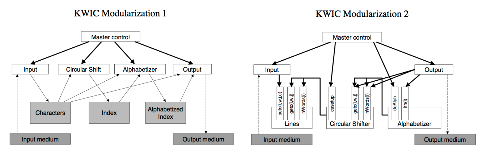
The first one. It is easier to understand the general idea.

### Java:
#### What is the java virtual machine and why is it so important?
JVM is an abstract computing machine creating a platform-independent execution environment that converts Java bytecode into machine language and execute it.
To support multi-platform portability of Java programs.

### Prolog, Erlang, Elixir:
#### Compare the scoping rules of standard languages that support nested blocks and clause-based languages like Prolog.
- nested block: local inside the whole block, global inside the whole program
- clause-based: only in the very clause, no  global.

#### Who created Erlang? What problem did Erlang solve? How does the scoping rules of Erlang clauses simplify concurrency?
Ericsson Computer Science Lab. It is designed with aim of improving development of telephony applications and for developing robust systems of programs that can be distributed among different computers in a network. Processes communicate using message passing instead of shared variables, which removes the need of explicit locks

#### What are the notable features of Erlang? List three, for each write down or explain where it might be used and the implications of that usage for software engineering?
Concurrent, garbage-collected, dynamic typing, hot swapping, fault-tolerant.

#### What is Elixir? How is it implemented?
A dynamic, functional language designed for building scalable and maintainable applications. It leverages the Erlang VM, for running low-latency, distributed and fault-tolerent system.

## Review 4
### Functional Programming:
#### What is currying in functional programming? Give an example and explain.
Currying is when you break down a function that takes multiple arguments into a series of functions that take part of arguments. 

### SQL and NoSQL:
#### What particular purpose SQL is optimized for ? Give three ways that SQL has this optimization.
Mantainabilty and Managing data in relational database system. 
- Relational constraints
- Database normalization
- Data integrity

#### State three differences betweenn SQL and NoSQL?
- tables vs documents
- schema vs schemaless
- normalization vs denormalization

#### What is database normalization? How SQL implements normalization? Give an example.
The process of efficiently organizing data in the database, by eliminating redundant data and ensuring data dependencies make sense.
- First normal form: define data items required, place related data item in a table; ensure no repeating groups of data; ensure existence of a primary key.
- Second normal form: no partial dependencies of any of the columns on the primary key.
- Third normal form: all nonprimary fields are dependent on the primary key.

#### What are the advantages and disadvantages of normalizaiton?
Advantage:
- Reduce data redundancy 
- Less update anormalies
- Group data logically
- Smaller tables for faster maintainance
- Join tables as needed (more flexible)

Disadvantage:
- Slow performance with complex relational join
- Data model difficult to query
- Require detailed analysis and complex design

#### Explain how SQL maintains layered architecture?
user/application layer, logic layer, physical layer.
SQL supports a layered architecture where all concerns about data storage, indexing, backing up, etc are handled in a database layer which applications talk to via a higher level SQL.

#### List and explain three drawbacks of SQL. How does NoSQL solves these drawbacks?
- Personnel cost: Require less management with features like automatic repair, easier data distribution, and simpler data models.
- Server cost: Typically use clusters of cheap commodity servers to manage exploding data and transaction volumes.
- Speed: Designed to expand transparently and horizontally to take advantage of new nodes with low-cost hardware.
- Quantity: No limits on data volumes
- Flexibility: Insert data without defining a rigid database schema.

#### What is NoSQL optimized for?
Flexibility and scalability.

#### What kind of applications should use NoSQL? Give an example and explain.
Large data size with various and flexible data format

#### What kind of application should not use NoSQL? 
Highly structured static data of high maintenance cost.

### Data anomalies:
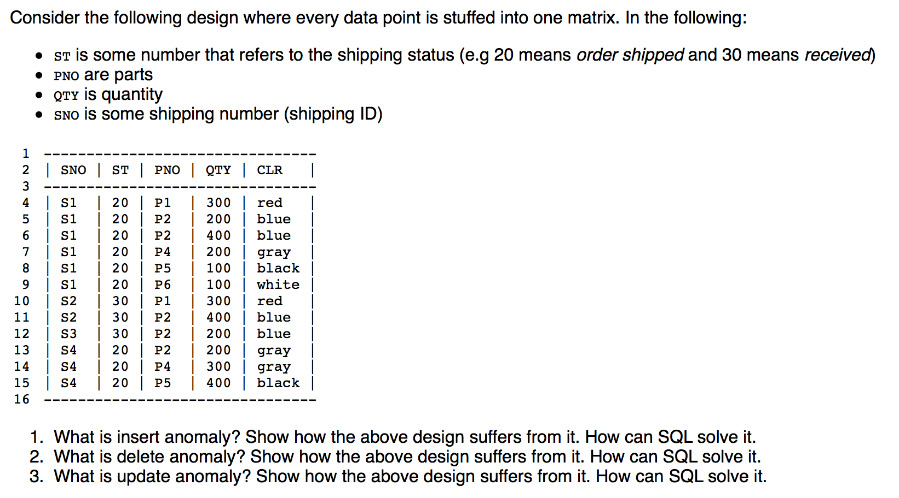
1. Unable to add new parts to inventory without new orders.
2. Unable to access the parts if the related shipment entry is deleted.
3. Unable to update part properties once it was sold, which may lead to reference error.

### ELM and JavaScript:
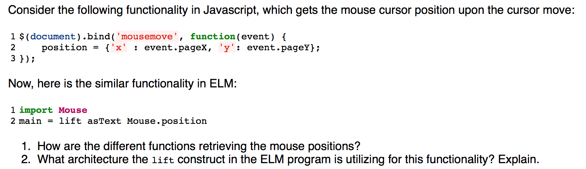
1. JS: event handler and callback; ELM: Signals
2. MVC

## Review 5
### Test Driven Development:
#### State and explain the phases of test driven development cycle?
1. Add a test(RED): each new feature begins with writing a test based on the understanding the feature's specification and requirements.
2. Run all tests and see if the new one fails(RED): validate the test harness is working correctly.
3. Write some code (GREEN): to pass the test
4. Run tests(GREEN): check pass or adjust otherwise
5. Refractor code: clean up growing code regularly.

#### What are the advantages and disadvantages of Test Driven Development? List and explain three.
Advantage:
- Offer more than just simple validation of correctness, but can also drive the design of a program.
- offer the ability to take small steps when required.
- Total code implementation time could be actually shorter.
- Lead to more modularized, flexible, and extensible code.

Disadvantage:
- Unit tests are smalll while function tests are much larger. 
- Many tests may be informative.

#### A company shows you their new very fast edit/compile/run tool for some language. They claim that the language will significantly reduce software development time. Based on the theory presented in this class, would you doubt that claim. Justify.

#### What are the heuristics for not testing all the time?
Evaluate the feedback loops in your development process. Integrate code more frequentyly. Reduce the build and integration times. Cut the unit tests and go more for integration testing.

#### What is a mock in Test Driven Development? What purpose does it serve?
A mock is a stand-in for a real module. It doesn’t contain any real functionality but rather imitates a module’s interface. When used in a test, a mock intercepts calls between the module under test and the mocked module. If the function being called has a return value, the mock for that function will also return a value as specified in the test. A programmer typically creates a mock object to test the behavior of some other object, in much the same way that a car designer uses a crash test dummy to simulate the dynamic behavior of a human in vehicle impacts.

### Refractoring:
#### What is YAGNI?
You aint gonna need it.

#### What is the rule of three for refractoring?
Rule of three is a code refactoring rule of thumb to decide when a replicated piece of code should be replaced by a new procedure. It states that the code can be copied once, but that when the same code is used three times, it should be extracted into a new procedure.

## Review 6
### Design patterns:
#### What is the Composite pattern? Give an example and explain its components.
The composite pattern is a partitioning design pattern. The composite pattern describes that a group of objects is to be treated in the same way as a single instance of an object. The intent of a composite is to "compose" objects into tree structures to represent part-whole hierarchies. Implementing the composite pattern lets clients treat individual objects and compositions uniformly.
e.g. Although the example is abstract, arithmetic expressions are Composites. An arithmetic expression consists of an operand, an operator (+ - * /), and another operand. The operand can be a number, or another arithmetic expresssion. Thus, 2 + 3 and (2 + 3) + (4 * 6) are both valid expressions.

#### What is the cascade-delete policy? How can it be applied to editing directories in file system.s and data in SQL?
Whenever rows in the master (referenced) table are deleted (or updated), the respective rows of the child (referencing) table with a matching foreign key column will be deleted (or updated) as well. This is called a cascade delete (or update).

#### What is the Proxy design pattern? Give an example and explain its components.
A class functioning as an interface to something else. In short, a proxy is a wrapper or agent object that is being called by the client to access the real serving object behind the scenes. For the client, usage of a proxy object is similar to using the real object, because both implement the same interface.

#### How does Proxy handle DRY?
Provide accesses to the repeated function with the function defined only once.

#### What is Singleton design pattern? Give an example and explain its components.
Ensure a class only has one instance and provide a global point of access to it.

### What is the underlying design patterns common in the following browsing systems? Explain.
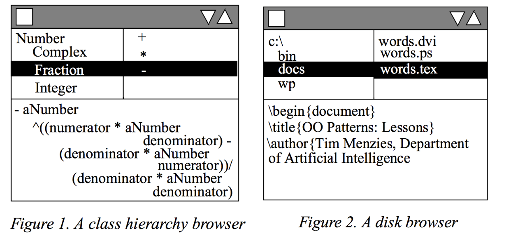
Composite browser.

#### What is DRY? What problem is anti-DRY in layered architecture? 
Don't Repeat Yourself. Layers are not really separated, so much interaction.

#### What is the Visitor pattern? Give an example and explain its components.
It is a way of separating an algorithm from an object structure on which it operates. A practical result of this separation is the ability to add new operations to existing object structures without modifying those structures.

#### How can polymorphism solve the problem of OO abuse bad smell in switch statements?
Relatively rare use of switch and case operators is one of the hallmarks of object-oriented code. Often code for a single switch can be scattered in different places in the program. When a new condition is added, you have to find all the switch code and modify it. As a rule of thumb, when you see switch you should think of polymorphism. Create subclasses matching the branches of the conditional. In them, create a shared method and move code from the corresponding branch of the conditional to it. Then replace the conditional with the relevant method call. The result is that the proper implementation will be attained via polymorphism depending on the object class.

### Arthur Riel's OO Design Heuristics:
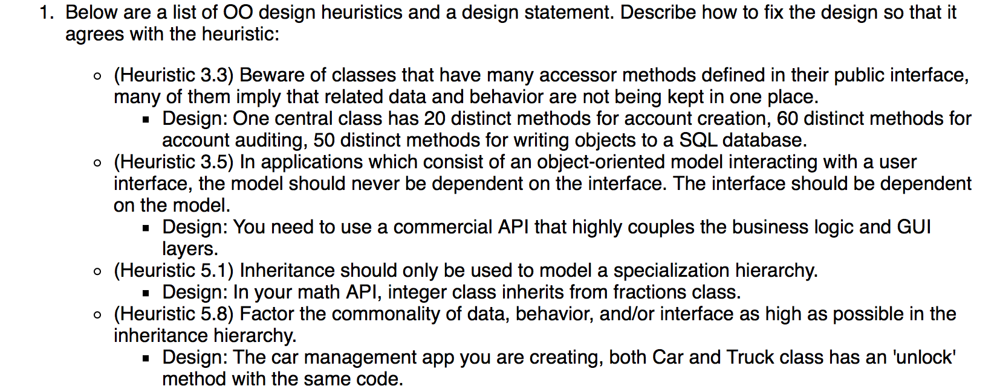

### Anti-patterns:
#### What are anti-patterns. List three.
A common response to a recurring problem that is usually ineffective and risks being highly counterproductive.

#### For each of the anti-patterns below give three examples:
- [ ] Bloated: Long method; Large class; Long parameter list. Data clumps.
- [ ] OO-abusers:  Switch statements; Temporary field; Alternative classes with different interfaces.
- [ ] Dispensables: Duplicate code; Lazy class; Dead code.

## Review 7
### Lazy Evaluation & goto:
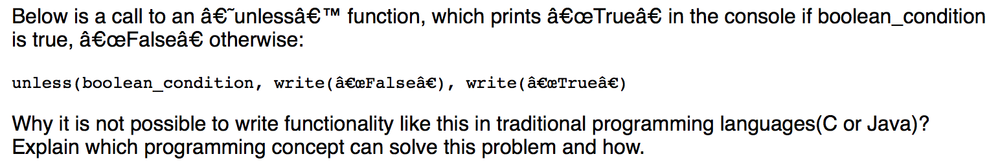
Because traditional language will actively evaluate the arguments, in this case write(), so that both False and True will be printed before unless is evaluated.
Lazy evaluation solve this by no evaluation of the arguments until the final implementation of the unless() function.

#### Why is goto considered harmful? Give an example and explain.
- Too many goto can mess up the code readability.
- If the workflow is one-directional, goto can make it backward, which twists the logic.
- Goto can jump out of the code block without proper judgement of conditions, which lead to errors.

#### Give an example where goto can be useful?
- To make the code more readable and easier to follow
- To make smaller programs, and get rid of code duplication
- For implementing multi-level break and continue if not directly supported in the language
- Transitions in finite-state machines 

### Closures:
#### What is a closure? How is a closure created?
Closures (also lexical closures or function closures) are a technique for implementing lexically scoped name binding in languages with first-class functions. Operationally, a closure is a record storing a function[a] together with an environment: a mapping associating each free variable of the function (variables that are used locally, but defined in an enclosing scope) with the value or storage location to which the name was bound when the closure was created.

A closure is created when:
- The scope of some inner function refers to an outer scope's variables.
- The inner function is passed around as a varable, carrying with it the inner scope and the outer scope.

#### How can closures be applied? Give an example and explain.
Parallelism: Enter closures. Bundle all needed into closures, call functions, each running on its own thread.
Package, objects, classes.
Data - Model - Dialog

#### There are many ways to create a closure. Describe one of those ways.
Closures generated by model objects and cached in dialog layer.

#### In the following code snippet, the last line of output is wrong. What should it generate? Explain exactly why it generates that output? 
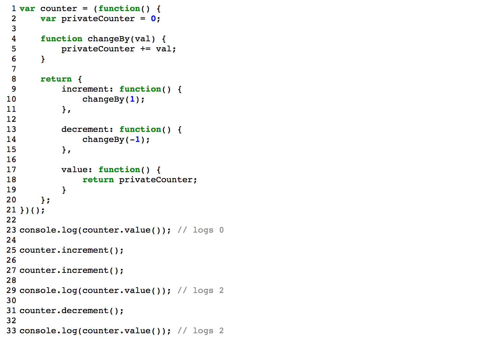
output is 1. 

#### What features of OO programming are demonstrated by the above example? What features are missing from the above?
Feature demonstated: Class and Objects; Encapsulation.
Feature missing: Inheritance; Polymorphism.

## Review 8
### Effort Estimation:
#### What is the Delphi (expert) method of software effort estimation? When would you want to estimate using Delphi method?
Use human expertise (possibly augmented with process guidelines, checklists, and data) to generate predictions.
When I have human expertise in my team.

#### What is the algorithmic (model based) method of software effort estimation? When would you want to estimate using algorithmic method?
build models via data mining or via expert intuition then make use those models to make predictions about new projects e.g. data mining.

good for finding the uncertainty in an estimate.  so when I want to know the uncertainty of the extimation.

#### What is overestimation and underestimation? What are their effects on development? 
When people overestimate, the feature will still get done, just at the expense of wasted time. When people underestimate, it's possible that the feature will never get done.

#### State two problems with effort estimation and explain them.
 - Problem1: Uncertainty
  - We don't know how hard it will be to build software, until we build it.
 - Problem2: Better,Faster,Cheaper (pick any two)
  - Estimation is a multi-goal optimization problem
 - Problem #3: Relucatance to Learn from Experience
  - many commercial software engineers generalize from their first few projects to all future projects 2.
  - commercial estimation “gurus” rarely use lessons from past projects to improve their future estimates
 
 

#### State three strategies, tacts, methods to solve the problems with effort estimation.
- Strategies:
  - Feature maturity : don't estimate software, reward delivery.
  - Big bang : estimate at the start to allocate resources
  - Spiral : project plan includes "stop! its not working!" points
  - Many bangs : continuous small estimation (e.g. local stories, active learning)
  - Lie : invent some nonsense number to make your manager happy
  - Don't estimate : the #noestiamtion camp. But really they do estimate (but more with many bangs and not just Big Bang).

- Tactics (so many; here's a sample):
  - Parametric : fit to an pre-guest distribution; e.g. COCOMO
  - Case-Based Reasoning : new estimates are variations of old (but similar examples)
  - Planning poker : Don't estimate, just rank work most to least expensive
  - Ensemble : Multiple estimates, combined (e.g. top-down, bottom-up, bagging, boosting)
  - Stability studies : Do the sample "N" times using small variations in the assumptions.

- Methods
  - Delphi/Expert methods : use human expertise (possibly augmented with process guidelines, checklists, and data) to generate predictions 4
   - (good for producing one estimate, not a range of estimates)'
  - Algorithmic/Model-based methods : build models via data mining or via expert intuition then make use those models to make predictions about new projects e.g. data mining
   - good for finding the uncertainty in an estimate).
  - Combo : both the above.

#### What is feature maturity? What kind of organizations are suitable for adopting this strategy?
 don't estimate software, reward delivery.
 
- Large organizations with an existing product and cash flow work as follows.
- Productivity via social engineering
- Developers compete to get their new feature mature enough to add into existing platform.
- The "wining" developers are rewarded (financially at annual review time, with promotions) if their features make it in.

#### What are the characteristics of the big bang effort estimation?
estimate at the start to allocate resources
- Traditional method for large government projects
- Needed when development part of very large resource allocations (e.g. CLCS)
- Standard practice is to build two estimates:
  - The one you show the client (so you can get the estimate)
  - The real one (so if you get the work you know how much trouble you are in if you get the work).
- Major weakness: If the scope or technology changes during the period of the project, then the big bang's estimates will be wildly inaccurate.
- 

#### What are the properties of the spiral model? How does it deal with the risk management issue?
 - These "prototypes" are MUCH bigger than agile SRUMS. Weeks to months to years of work.
 - After a few rounds of the spiral, project becomes a standard waterfall.
 - There is a "commit partition" (shown left hand side). Projects are canned if we get to the commit point, and some critical functionality is still not working.
- Hard to go Spiral if you work for an external software consultants who are struggling for jobs
- Since any cancellation may be fatal to their plans.

#### What kind of developer and/or development strategy is suited for leveraging of many bangs strategy? 
- Make Starting Amount of Money Small; Deliver Working Software Often
- Fund a Pilot That Delivers Working Software; Then Use Modeling to Forecast Schedule
- Move From Contract Negotiation to Partnership
 
#### What are the scenarios that facilitate the no estimation strategy? When is the case that it is not suitable to adopt no estimation?
- A tempting for products that charge a per-user, per-month fee that are already cash-flow positive.
  - I.e. If your organization makes enough money to run itself, and if you view time spent estimating as time not developing, then you might abandon estimates and just write code. T
-  Not recommended when:
  -  In a budget conscious environment
  -  In a cost-cutting environment
  -  When you are required to audit your cost decisions:

#### Very briefly explain the following approaches to effort estimation: Big bang, can't use Delphi models, should use algorithmic models like COCOMO.

#### You have to build a very large scale system for the government, which requires you to provide your estimate to the government for the funding. What kind of effort estimation strategy would you use and why?

 Big Bang: estimate at the start to allocate resources
- Traditional method for large government projects
- Needed when development part of very large resource allocations (e.g. CLCS)
- Standard practice is to build two estimates:
  - The one you show the client (so you can get the estimate)
  - The real one (so if you get the work you know how much trouble you are in if you get the work).

### Planning Poker:
also called Scrum poker, is a consensus-based, gamified technique for estimating,

#### What are the properties of planning poker?
Does not estimate, but it ranks

Poorly studied. Only a handful of studies. 

#### What kind of software develoment strategy uses planning poker?
 It is most commonly used in agile software development, in particular in Scrum and Extreme Programming.
 
 
#### What is the purpose of using planning poker?
The reason to use Planning poker is to avoid the influence of the other participants. 

If a number is spoken, it can sound like a suggestion and influence the other participants' sizing. Planning poker should force people to think independently and propose their numbers simultaneously. This is accomplished by requiring that all participants show their card at the same time.

### COCOMO:
#### For each of the follwoing pre-defined values in the COCOMO model, explain whether an increase in their individual values would result in a faster or slower development:
- [ ] Analyst Capability: faster.
- [ ] Multi site development: slower.
- [ ] Use of software tools: faster.
- [ ] Product complexity: slower.

#### COCOMO is a parametric effort estimation method. Define parametric methods, using COCOMO as the example?

The Constructive Cost Model (COCOMO) is an algorithmic software cost estimation model. It uses a basic regression formula with parameters that are derived from historical project data and current as well as future project characteristics.

### Case Based Reasoning:
#### In what sense is case-based reasoning NOT a parametric method? When might case-based work better than parametric methods?
- CBR seeks to emulate human recollection and adaptation of past experiences in order to find solutions to current problems.

- CBR was first motivated by appeals to human cognition. 
- Humans don't think, they remember.

1. CBR has several advantages. Firstly, when the cache of past cases is updated and appended with additional cases, then a CBR system is instantly updated to the latest findings.

2. Secondly, the output of a CBR is made on a ``case-by-case'' basis. That is, CBR does not offer some trite generalization over multiple examples. Rather, the advice it gives is specialized to the particular case being considered at the current time.

#### Define MRE?
Magnitude of Relative Error
- mre = 100 * abs(predicted - actual) / actual

#### An analyst offers a single MRE as the estimate of an error a project. What are the drawbacks with that single number?
May not accurate. high bias.

#### What are ways to generate expected ranges of estimates?

#### From the following dataset, guesstimate the unknown value of Khours for the last data row with all the independent values given using 1 nearest neighbor. Assume that the new project does multisite development, use some, but not lots, of software tools, the product is very complex. Show all your work.
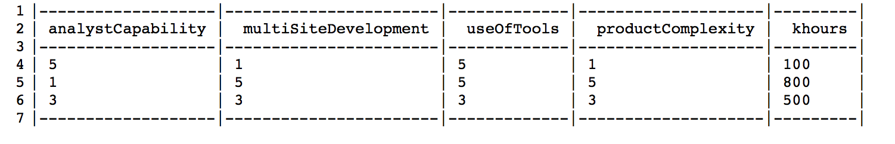
